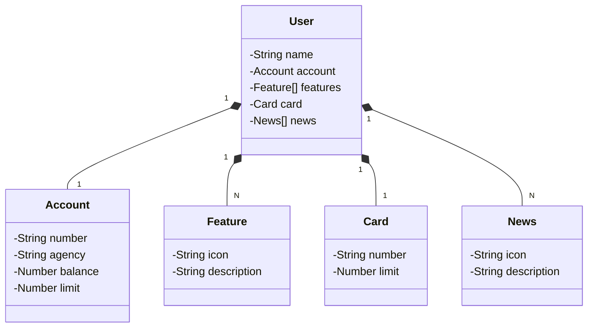

# Santander Dev Week 2023

Reprodução do Dio Lab "Publicando Sua API REST na Nuvem Usando Spring Boot 3, Java 17 e Railway", pela Digital Innovation One.

Java RESTful API criada para o Santander Dev Week.

## Diagrama de Classes

